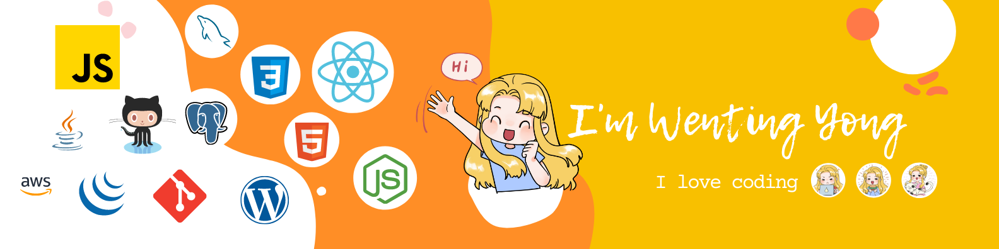

# Hi there, I'm Wenting (she/her) - aka [Zoe] 👋 

## I'm a Developer, Designer, and Analyst!!
A web developer passionate about digital transformation and building products that solve real world problems.i take great care in the experience, architecture, and code quality of the things I build.

- 🌱 I’m currently learning everything 🤣
- 👯 I’m looking for a web developer position! do reach, [email](mailto:ywtzeroing@outlook.com) me!
- 🥅 2023 Goals: Learn more about web development, become a better developer & designer.
- ⚡ Fun fact: I love to DIY and I'm a botanical gardener 🌱

### Connect with me:

<!-- &nbsp;&nbsp;

 -->
&nbsp;&nbsp;

&nbsp;&nbsp;

### Languages and Tools:

 

<!-- 
 -->

 
 

<!-- [website]: https://codeSTACKr.com
[course]: http://vsCodeHero.com
[twitter]: https://twitter.com/codeSTACKr
[youtube]: https://youtube.com/codeSTACKr
[instagram]: https://instagram.com/codeSTACKr
[linkedin]: https://linkedin.com/in/codeSTACKr
[webdevplaylist]: https://www.youtube.com/playlist?list=PLkwxH9e_vrAJ0WbEsFA9W3I1W-g_BTsbt
[jsplaylist]: https://www.youtube.com/playlist?list=PLkwxH9e_vrALRJKu7wfXby3MKeflhTu6B
[cssplaylist]: https://www.youtube.com/playlist?list=PLkwxH9e_vrALSdvZuEh6gqQdmDoDIoqz4
[reactplaylist]: https://www.youtube.com/playlist?list=PLkwxH9e_vrAK4TdffpxKY3QGyHCpxFcQ0 -->
